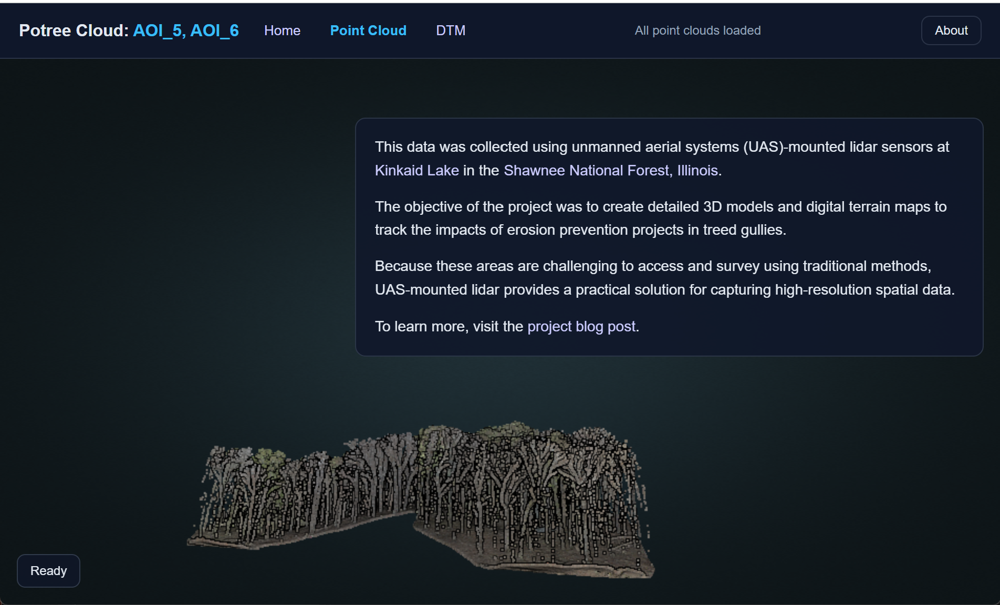
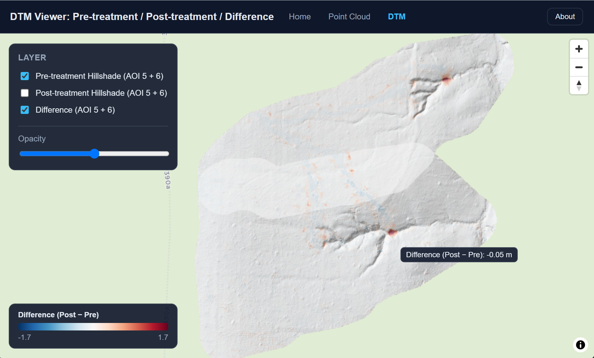

# uas-viz

Tools, static sites, and upload helpers for UAV visualization workflows. The repository currently supports two main publishing paths:

- `dtm-static-site/` for Cloud Optimized GeoTIFF (COG) raster viewers.
- `potree-static-site/` for Potree point cloud viewers.

The repo is intentionally lightweight: there is no central web application or backend service. Most work happens with local Python scripts, GDAL utilities, and static hosting.

## Summary 
This repository provides tools and static site templates for visualizing UAV data, including DTM rasters and Potree point clouds. 

The repository is designed as a lightweight viewer to inspect and interact with UAV-derived geospatial data without the overhead of a full-fledged web application.

### Point cloud viewer

[`potree-static-site/`](potree-static-site/) hosts a [Potree](https://potree.github.io/)-based point cloud viewer.



Typical workflow:

1. Convert your point cloud data to the Potree format using the PotreeConverter.
2. Upload the converted point cloud to a bucket or object store that supports HTTP Range requests.
3. Update `potree-static-site/config.js` with the hosted point cloud URL and viewer settings.
4. Serve the folder locally with the bundled range-aware server.


### DTM Raster Viewer

[`dtm-static-site/`](dtm-static-site/) hosts a simple raster comparison viewer for pre-treatment, post-treatment, and difference COGs.



Typical workflow:

1. Generate or prepare three `EPSG:3857` COGs (pre-treatment, post-treatment, and difference) with GDAL.
2. Upload them to a bucket or object store that supports HTTP Range requests.
3. Update `dtm-static-site/config.js` with the hosted COG URL prefix and map view.
4. Serve the folder locally with the bundled range-aware server.

### Next steps

Additional components that could be added include: 
- Annotation tools for point clouds.
- Measurement tools for distances and areas.
- Integration with other geospatial data sources.
- Custom styling and theming options for the viewer.


## User Requirements

Install the following before working in this repo:

- Python 3.10 or newer.
- GDAL command-line tools and Python bindings (`gdal`, `osgeo`).
- Google Cloud SDK, which provides `gsutil`.
- Node.js 18+ if you want a general-purpose static server such as `npx serve`
  or plan to add front-end tooling later.
- A modern browser with HTTP Range request support.

On Windows, the easiest setup is usually:

- Python from python.org, Anaconda, Miniconda, or an existing virtual
  environment.
- GDAL from a distribution that includes both the CLI tools and Python
  bindings. The repo’s `requirements.txt` notes the common Windows wheel
  approach (`gdal / osgeo from cgohlke whl`).
- Google Cloud SDK installed separately so `gsutil` is on `PATH`.

## Quick Start

1. Clone the repository and open it in VS Code.
2. Create or activate a Python environment.
3. Install the Python dependencies you need for your workflow.
4. Verify that `gdalinfo` and `gsutil` are available from a terminal.
5. Use the site-specific instructions below for DTM rasters or Potree clouds.

Example environment check on Windows PowerShell:

```powershell
python --version
gdalinfo --version
gsutil version -l
node --version
```

## Python Environment

The repo does not currently ship a single pinned package set. The helper scripts are small and mostly rely on the standard library plus external tools.

If you want a dedicated environment, create one and install whatever your workflow requires, for example GDAL bindings and any raster-processing packages you use upstream.

## DTM Static Site

[`dtm-static-site/`](dtm-static-site/) hosts a simple raster comparison viewer for pre-treatment, post-treatment, and difference COGs.

Typical workflow:

1. Generate or prepare three `EPSG:3857` COGs (pre-treatment, post-treatment, and difference) with GDAL.
2. Upload them to a bucket or object store that supports HTTP Range requests.
3. Update `dtm-static-site/config.js` with the hosted COG URL prefix and map
   view.
4. Serve the folder locally with the bundled range-aware server.

Example COG creation commands:

```bash
gdal_edit.py -a_nodata nan pre_treatment_source.tif

gdalwarp pre_treatment_source.tif pre_treatment.tif -of COG \
  -co TILING_SCHEME=GoogleMapsCompatible \
  -co COMPRESS=LERC -co MAX_Z_ERROR=0.1 \
  -co RESAMPLING=BILINEAR -co OVERVIEW_RESAMPLING=AVERAGE \
  -co ZOOM_LEVEL_STRATEGY=UPPER \
  -co OVERVIEWS=IGNORE_EXISTING -co ADD_ALPHA=NO
```

`tools/convert_tifs_to_cogs.py` wraps this with the same defaults (including `ZOOM_LEVEL_STRATEGY=UPPER`, needed to keep high-resolution UAS rasters from being silently downsampled when snapped to the Web Mercator tiling scheme).

To convert local rasters to COGs and upload them to Google Cloud Storage in one step, use the wrapper:

```powershell
python tools/convert_and_upload_cogs.py .\data -d gs://uas-viz/dem_tifs
```

If you already have converted COGs on disk and only want to upload them, keepusing the upload helper directly:

```powershell
python tools/upload_cogs_to_gcs.py D:\FY26\uas\cogs -d gs://uas-viz/cogs
```

Local serving:

```powershell
cd dtm-static-site
./serve.ps1
```

Then open `http://localhost:8080/`.

## Potree Static Site

[`potree-static-site/`](potree-static-site/) is the minimal deployment pattern
for a Potree point cloud viewer.

Typical workflow:

1. Copy the Potree distribution into `potree-static-site/vendor/potree/`.
2. Copy generated Potree point cloud output into `potree-static-site/pointclouds/`.
3. Serve the folder locally with the bundled range-aware server.
4. Publish the folder to a static host when ready.

Local serving:

```powershell
cd potree-static-site
./serve.ps1
```

Then open `http://localhost:8080/`.

## Google Cloud Storage Uploads

[`tools/convert_and_upload_cogs.py`](tools/convert_and_upload_cogs.py) turns
source GeoTIFFs into COGs and uploads them to a `gs://` prefix in one step.
If you already have COGs, [`tools/upload_cogs_to_gcs.py`](tools/upload_cogs_to_gcs.py)
uploads `.tif` and `.tiff` files while preserving subdirectory structure. Both
scripts set long-lived cache-friendly metadata by default.

Both scripts require the Google Cloud SDK and expect a destination that starts
with `gs://`.

Example:

```powershell
python tools/convert_and_upload_cogs.py D:\FY26\uas\cogs -d gs://uas-viz/cogs
```

## Range-Supporting Local Servers

Both static sites include a small `serve_range.py` helper. Use it for local
development whenever browser code needs HTTP Range requests. Plain
`http.server` is not enough for COG reads.

The bundled `serve.ps1` scripts simply change into the folder and launch the
Python range server on port 8080.

## Repository Layout

```text
README.md
requirements.txt
dtm-static-site/
landing-page/
potree-static-site/
tools/
```

## Deployment

The static sites are designed to be published as plain files. The repo already
follows a GitHub Pages style layout with a landing page, a DTM viewer, and a
Potree viewer.

## Notes

- `requirements.txt` currently documents the small Python dependency surface
  used by the helper scripts.
- `dtm-static-site/README.md` contains more detail on the DTM workflow.
- `potree-static-site/README.md` contains more detail on the point cloud
  workflow.
